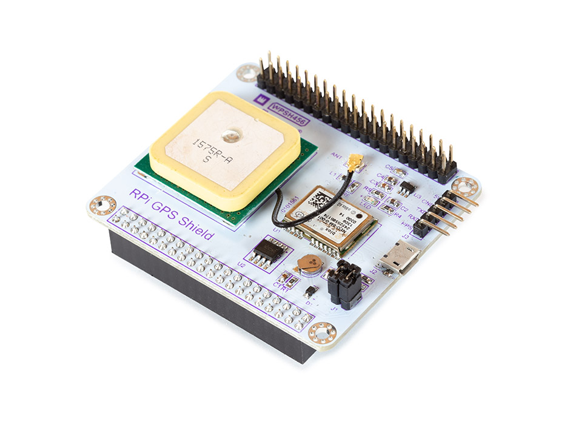

# Whadda NEO-6M GPS shield for RPi example code


This example shows you how you can use the GPS data from the GPS module in your own python scripts.
The example python file prints the current GPS position (latitude, longitude), time and the number of satellites in sight.

## Installation

For this example to work properly, **gpsd** needs to be installed and configured properly. 

### Installing and configuring gpsd
Follow the steps in the manual of the Whadda NEO-6M GPS shield, available from the [whadda.com product page](http://www.velleman.eu/products/view/?id=461496&lang=en). In short:


1. Enable the serial interface (necessary to communicate with the GPS shield) by running 
sudo raspi-config and selecting ```3 Interface Options > P6 Serial Port > No (to have the login shell accessible over serial) > Yes (enabling the serial port hardware)```. 
It is advised to reboot the Pi after this step by typing ```sudo reboot```.
2. Open the  boot ```config.txt``` configuration file by typing in: ```sudo nano /boot/config.txt``` and add the following line:
    ```
    dtoverlay=disable-bt
    ```
3. Type in the following command to make sure the Bluetooth module is completely disabled:

    ```sudo systemctl disable hciuart```

4. Perform a reboot by typing in ```sudo reboot```

5. Install gpsd and gpsd-clients by running the following command:

    ```sudo apt install gpsd gpsd-clients -y```

6. Disable the gpsd service that started running automatically by running the following command:

    ```sudo systemctl disable gpsd.socket```

7. Start a new gpsd instance that redirects the GPS data to the correct serial port by typing in the following command:

    ```sudo gpsd /dev/ttyAMA0 -F /var/run/gpsd.sock```

8. The GPS decoding deamon should be up and running now. To check if it is able to receive and parse the GPS data run the following command: ```sudo gpsmon```

### Downloading the example code

Use git clone to download the repository:
```
git clone https://github.com/WhaddaMakers/Neo-6M-RPi-GPS-shield.git
```
Navigate to the folder with the example code:
```
cd Neo-6M-RPi-GPS-shield
```


### Installing the required python modules

Install the required python libraries by runnning the following command:

```
pip3 install -r requirements.txt
```

Requirements list:
* [gpsd-py3](https://github.com/MartijnBraam/gpsd-py3)


## Running the example code

You can run the example by using the following command:

```
python3 gps_3.py
```

If the GPS module has a fix, it prints out the current GPS position (latitude, longitude), time and the number of satellites in sight.
